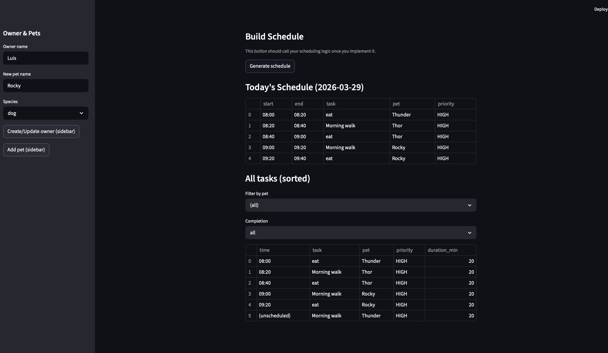
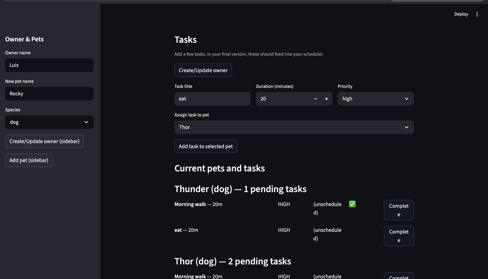

# PawPal+ (Module 2 Project)

You are building **PawPal+**, a Streamlit app that helps a pet owner plan care tasks for their pet.

## Scenario

A busy pet owner needs help staying consistent with pet care. They want an assistant that can:

- Track pet care tasks (walks, feeding, meds, enrichment, grooming, etc.)
- Consider constraints (time available, priority, owner preferences)
- Produce a daily plan and explain why it chose that plan

Your job is to design the system first (UML), then implement the logic in Python, then connect it to the Streamlit UI.

## What you will build

Your final app should:

- Let a user enter basic owner + pet info
- Let a user add/edit tasks (duration + priority at minimum)
- Generate a daily schedule/plan based on constraints and priorities
- Display the plan clearly (and ideally explain the reasoning)
- Include tests for the most important scheduling behaviors

## Getting started

### Setup

```bash
python -m venv .venv
source .venv/bin/activate  # Windows: .venv\Scripts\activate
pip install -r requirements.txt
```

### Suggested workflow

1. Read the scenario carefully and identify requirements and edge cases.
2. Draft a UML diagram (classes, attributes, methods, relationships).
3. Convert UML into Python class stubs (no logic yet).
4. Implement scheduling logic in small increments.
5. Add tests to verify key behaviors.
6. Connect your logic to the Streamlit UI in `app.py`.
7. Refine UML so it matches what you actually built.

## Smarter Scheduling

This project includes a small scheduling engine with several improvements over a naive task list:

- Sorting: tasks can be ordered by explicit scheduled times or by priority and duration.
- Filtering: you can filter tasks by pet and completion status to focus on relevant items.
- Recurrence: tasks that are `daily` or `weekly` automatically create the next occurrence when completed.
- Conflict detection: the scheduler performs lightweight overlap checks and returns readable warnings rather than crashing; this keeps the UX informative while remaining simple.

These features are implemented in `pawpal_system.py` and demonstrated by `main.py`. They are intentionally lightweight and easy to extend as the app's requirements grow.

## Testing PawPal+

Run the automated test suite with:

```bash
python -m pytest
```

What the tests cover:
- Core dataclass behaviors (task completion, adding tasks to pets).
- Scheduler behaviors: sorting tasks by time, generating daily recurring tasks, and detecting scheduling conflicts.

Confidence Level: ★★★★☆ (4/5) — All current tests pass locally (unit tests exercise core behaviors and edge cases like duplicate times and recurrence), but the scheduler is intentionally simple and would benefit from additional integration and performance tests before production use.

## Features

- Sorting by time: Tasks with explicit `scheduled_time` are honored and tasks can be sorted chronologically using `Scheduler.sort_by_time()`.
- Priority-based ordering: Tasks without explicit times are ordered by priority (HIGH → MEDIUM → LOW) and shorter durations are preferred when scheduling.
- Filtering: Filter tasks by pet name and completion status with `Scheduler.filter_tasks()`; the Streamlit UI exposes these filters.
- Daily/Weekly recurrence: Tasks marked with `frequency = 'daily'` or `'weekly'` automatically generate the next occurrence when completed.
- Conflict detection: Lightweight overlap checks detect conflicting `TimeSlot`s and return readable warnings (no crashes).
- Greedy scheduling: A simple scheduler fills the day window (08:00–20:00) while honoring explicit scheduled times when present.
- Streamlit integration: `app.py` persists `Owner`/`Pet`/`Task` objects in `st.session_state`, displays schedules as tables, and surfaces warnings using `st.warning()`.
- Automated tests: Unit tests exercise sorting, recurrence, and conflict detection (`tests/test_pawpal.py`).

## 📸 Demo

View screenshots of the app (click any image to open full-size in a new tab):

<a href="assets/course_images/IMG_2238.png" target="_blank"></a>
<a href="assets/course_images/IMG_6989.png" target="_blank"></a>

